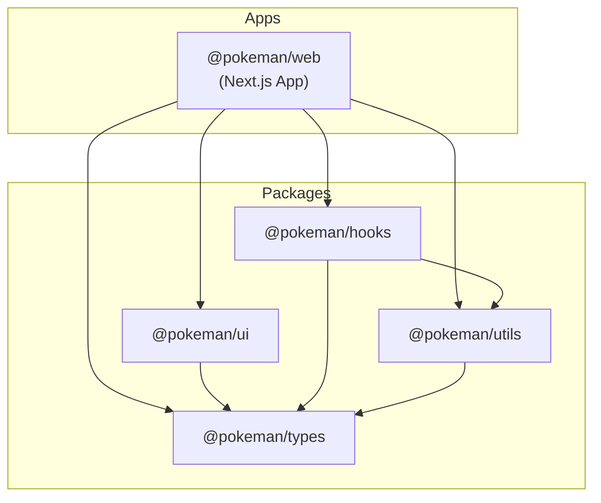

# Pokédex Monorepo

This project is a Pokédex application built using a monorepo architecture with **Yarn Workspaces** and **Turborepo**. The structure is designed to keep the codebase organized, reusable, and easy to maintain by separating shared functionality into dedicated packages.

---

## 🏗️ Project Structure

The application is divided into a main web application and several shared packages.

### 📱 Applications

- **`@pokeman/web`**
  - Built with Next.js 15 and React 19.
  - Serves as the main user-facing application.
  - Displays Pokémon data and consumes all shared packages.

### 📦 Shared Packages

- **`@pokeman/ui`**
  - Contains reusable UI components built with Material UI (MUI).
  - Includes Storybook for isolated component development and testing.

- **`@pokeman/hooks`**
  - Provides reusable React hooks for data fetching and business logic.

- **`@pokeman/utils`**
  - Contains shared utility functions such as API helpers, formatters, and common logic.

- **`@pokeman/types`**
  - Centralized TypeScript interfaces and types used across the project.

---

## 🔄 Dependency Flow



The web application consumes all shared packages, while shared packages can also depend on one another where needed to avoid code duplication and maintain consistency.

---

## 🛠️ Getting Started

### Prerequisites

Before running the project, make sure you have:

- **Node.js** v18 or higher (v20+ recommended)
- **Yarn Classic** v1.22.x

### Install Dependencies

From the project root directory:

```bash
yarn install
```

---

## 🚀 Running the Application

Start the Next.js development server:

```bash
yarn dev
```

The application will be available locally and will automatically reload when changes are made.

---

## 🏗️ Building the Project

Create a production build:

```bash
yarn build
```

---

## 🧪 Running Tests

Run unit tests:

```bash
yarn test
```

---

## 📚 Storybook

Launch Storybook to develop and test UI components in isolation:

```bash
yarn storybook
```

Storybook runs on port **6006** by default.

---

## 📜 Available Scripts

| Command | Description |
|----------|-------------|
| `yarn dev` | Starts the Next.js development server |
| `yarn build` | Creates a production build of the application |
| `yarn test` | Runs unit tests |
| `yarn storybook` | Launches Storybook for UI component development |

---

## 🤖 CI/CD Pipeline

The project includes a GitHub Actions configuration for Continuous Integration (CI), located at `.github/workflows/ci.yml`.

The pipeline runs automatically on:
- All pushes to the `main` or `master` branches.
- All Pull Requests targeting `main` or `master`.

### Pipeline Steps:
1. **Repository Checkout**: Clones the repository codebase.
2. **Node.js Setup**: Prepares Node.js v20 and configures global caching for Yarn.
3. **Dependency Installation**: Runs `yarn install --frozen-lockfile` to ensure exact dependency version alignment.
4. **Turborepo Caching**: Restores and updates caching for Turborepo tasks to optimize build times.
5. **Code Linting**: Verifies code styling and standard rules.
6. **Testing**: Runs the test suite via Turborepo across all workspaces.
7. **Building**: Performs Next.js and workspace builds to verify compilability.

---

## 💡 Technical Decisions

### Monorepo Architecture

A monorepo approach was chosen to:

- Promote code sharing across applications and packages.
- Maintain a single source of truth for shared components and utilities.
- Simplify dependency management.
- Improve scalability and maintainability.

### TypeScript

TypeScript is used throughout the project to provide:

- Strong type safety.
- Better developer experience.
- Improved code quality and maintainability.

### Material UI (MUI)

Material UI serves as the primary UI framework because it offers:

- Consistent and modern design patterns.
- Accessibility support.
- Responsive and customizable components.

### Next.js

Next.js was selected for:

- Server-side rendering (SSR) and static site generation (SSG).
- Performance optimization.
- Modern React capabilities through the App Router.

---

## ✅ Assumptions

1. **Yarn Workspaces** is used as the package management solution.
2. Shared packages are designed to be reusable across multiple applications.
3. The project follows modern React and Next.js best practices.
4. Type safety, maintainability, and code reusability are prioritized throughout the codebase.

---

## 🎯 Summary

The project follows a modular monorepo architecture that encourages code reuse, maintainability, and scalability. By separating shared logic, UI components, hooks, utilities, and types into dedicated packages, the application remains easy to manage and extend as new features are introduced.